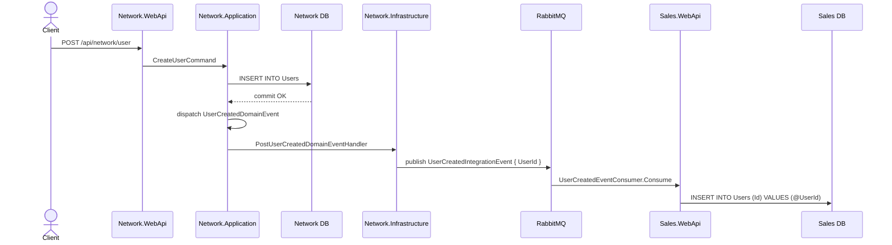
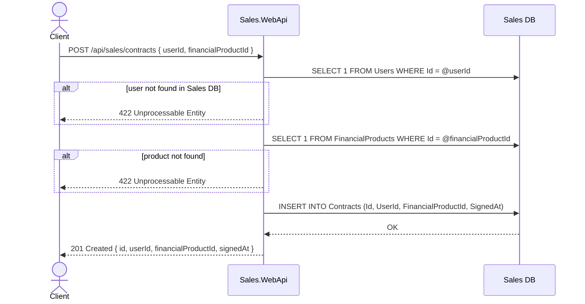
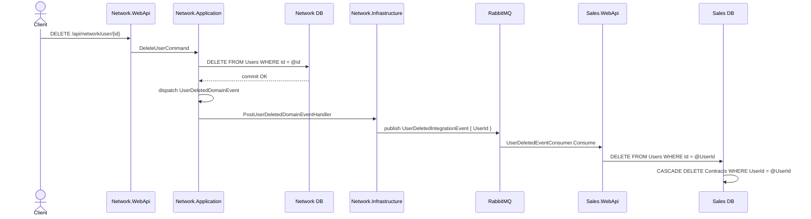

# User Replication and Contract Lifecycle Across Microservices

This document describes how user identity is propagated from the **Network** service to the **Sales** service via an integration event, how that replicated identity is used to enforce referential integrity when creating contracts, and how user deletion cascades to remove all associated contracts.

---

## Table of Contents

1. [Context](#1-context)
2. [Services Involved](#2-services-involved)
3. [Data Models](#3-data-models)
4. [Flow: User Created → Replicated to Sales](#4-flow-user-created--replicated-to-sales)
5. [Flow: Contract Created](#5-flow-contract-created)
6. [Flow: User Deleted → Contracts Cascade-Deleted](#6-flow-user-deleted--contracts-cascade-deleted)
7. [Design Decisions](#7-design-decisions)
8. [Limitations and Operational Notes](#8-limitations-and-operational-notes)

---

## 1. Context

Network and Sales are independent microservices that own separate databases. Sales needs to link contracts to users, but it must not query the Network database directly or hold a project reference to Network.

The chosen pattern is **event-driven shadow replication**: Network publishes integration events when users are created or deleted; Sales maintains a local `Users` table that mirrors only the user's `Id`. This single-column shadow table is enough to enforce a real foreign key constraint in the Sales database without coupling the services at the data layer.

---

## 2. Services Involved

| Service | Role in this scenario |
|---|---|
| **Network.WebApi** | Exposes the user registration and deletion HTTP endpoints |
| **Network.Application** | Handles commands; raises domain events after DB commit; translates them to integration events |
| **Network.Infrastructure** | Publishes integration events to RabbitMQ via MassTransit |
| **RabbitMQ** | Message broker; decouples publishers from consumers |
| **Sales.WebApi** | Consumes user events to maintain a shadow `Users` table; exposes the contract CRUD API |
| **Sales DB** | SQL Server database owned exclusively by Sales, holding `Users`, `FinancialProducts`, and `Contracts` |

---

## 3. Data Models

### Network DB (owned by Network)

```
Users
 └── Id (PK)
 └── ... (full user profile)
```

### Sales DB (owned by Sales)

```
Users
 └── Id (PK)                ← shadow copy, populated by integration events

FinancialProducts
 └── Id (PK)
 └── Name, Description, Price

Contracts
 └── Id (PK)
 └── UserId (FK → Users.Id, ON DELETE CASCADE)
 └── FinancialProductId (FK → FinancialProducts.Id, ON DELETE RESTRICT)
 └── SignedAt
```

The `UserId` foreign key uses `CASCADE` so that deleting a shadow user row automatically removes all of that user's contracts at the database level. `FinancialProductId` uses `RESTRICT` to prevent deleting a product that still has active contracts.

---

## 4. Flow: User Created → Replicated to Sales

### Sequence



### Step-by-step

1. A client calls `POST /api/network/user` with the user's profile.
2. `CreateUserCommandHandler` creates the `User` aggregate, which raises a `UserCreatedDomainEvent`.
3. `UserDbContext.SaveChangesAsync` persists the user to Network DB, then dispatches collected domain events.
4. `PostUserCreatedDomainEventHandler` translates the domain event into a `UserCreatedIntegrationEvent(UserId)` and publishes it via `MassTransitIntegrationEventPublisher`.
5. RabbitMQ delivers the message to the Sales service's consumer queue.
6. `UserCreatedEventConsumer` calls `UserRepository.AddAsync(UserId)`, inserting a single-column row into the Sales `Users` table.

After step 6 the Sales DB contains the user's `Id`, making it eligible as a valid foreign key target for contracts.

---

## 5. Flow: Contract Created

### Sequence



### Step-by-step

1. A client calls `POST /api/sales/contracts` with a `userId` and a `financialProductId`.
2. `ContractsController` checks that `userId` exists in the Sales `Users` table. If not, it returns `422 Unprocessable Entity` — the user has not yet been replicated (the integration event may still be in transit) or never existed.
3. The controller checks that `financialProductId` exists in `FinancialProducts`.
4. `Contract.Create(userId, financialProductId)` produces a new contract with `SignedAt` set to UTC now.
5. The contract is persisted to the Sales DB. The database enforces both FK constraints at commit time.
6. The controller returns `201 Created` with the new contract.

> **Note on eventual consistency:** There is a short window after user registration during which the integration event has not yet been consumed by Sales. A `POST /api/sales/contracts` call made in that window will receive `422`. Callers should retry with back-off if they need to create a contract immediately after user registration.

---

## 6. Flow: User Deleted → Contracts Cascade-Deleted

### Sequence



### Step-by-step

1. A client calls `DELETE /api/network/user/{id}`.
2. `DeleteUserCommandHandler` removes the user from Network DB and raises `UserDeletedDomainEvent`.
3. `PostUserDeletedDomainEventHandler` publishes `UserDeletedIntegrationEvent(UserId)` to RabbitMQ.
4. `UserDeletedEventConsumer` calls `UserRepository.DeleteAsync(UserId)`, which issues a bulk `DELETE FROM Users WHERE Id = @UserId`.
5. Because the `Contracts.UserId` foreign key is configured with `ON DELETE CASCADE`, SQL Server automatically deletes every contract belonging to that user in the same operation. No application code explicitly iterates contracts.

---

## 7. Design Decisions

### Why a shadow `Users` table instead of querying Network at runtime?

Microservices must own their data. If Sales called Network's API to validate a user ID on every contract creation, Sales would be runtime-coupled to Network's availability and latency. A local shadow table keeps Sales self-contained: it can validate and persist contracts even if Network is temporarily unavailable.

### Why store only the user's `Id` in the shadow table?

Sales has no business need for the user's name, email, or address. Storing only the `Id` minimises the synchronisation surface and means user profile updates in Network require no corresponding update in Sales.

### Why use `ON DELETE CASCADE` at the database level?

Using a database-level cascade instead of application-level iteration is atomic and does not require Sales to load and loop over potentially large contract lists. It also prevents orphaned contracts in edge cases where the application layer is interrupted mid-delete.

### Why `ON DELETE RESTRICT` for `FinancialProductId`?

Contracts represent a legal commitment to a specific product. Restricting deletion prevents removing a product that still has active contracts, forcing an explicit business decision (archive or migrate contracts first) before a product can be removed.

### Why not share a `UserCreatedIntegrationEvent` type from a shared library?

The microservice independence rules of this project forbid shared libraries across services. Instead, Sales defines its own copy of the record (`UserCreatedIntegrationEvent`, `UserDeletedIntegrationEvent`) in the publisher's original namespace (`Network.Application.Users.Events`). MassTransit routes messages by their fully-qualified type name on the broker, so the namespaces must match — but no source code is shared.

---

## 8. Limitations and Operational Notes

| Concern | Notes |
|---|---|
| **Event ordering** | If a `UserDeleted` event is consumed before a preceding `UserCreated` event (unlikely but possible in certain broker failure scenarios), the delete is a no-op (no row to delete). The subsequent `UserCreated` event would re-insert the shadow row without its contracts. Monitor for this in production via dead-letter queues. |
| **Eventual consistency window** | Contracts cannot be created until the `UserCreated` event has been consumed. Clients should expect and handle `422` responses with retry logic during this window. |
| **No contract archival** | Cascade deletion is permanent. If business requirements later demand soft-delete or archival of contracts on user removal, the cascade must be replaced with application-level logic and the `UserDeletedEventConsumer` updated accordingly. |
| **Financial product deletion** | `ON DELETE RESTRICT` means a financial product with existing contracts cannot be deleted via the database. Any product retirement workflow must handle contract migration or closure first. |
